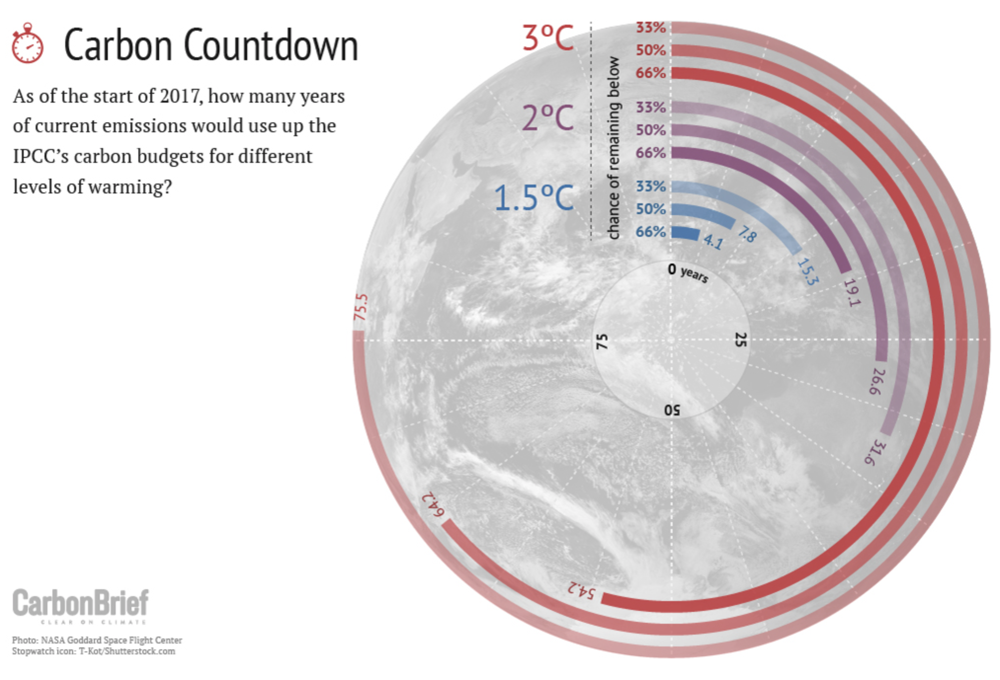
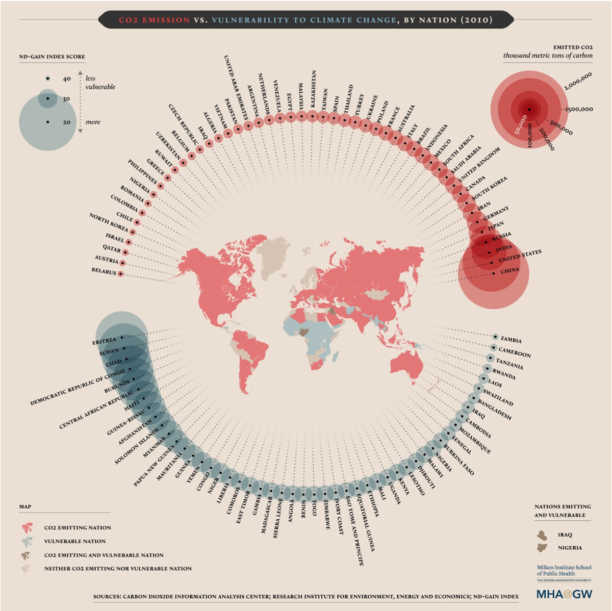
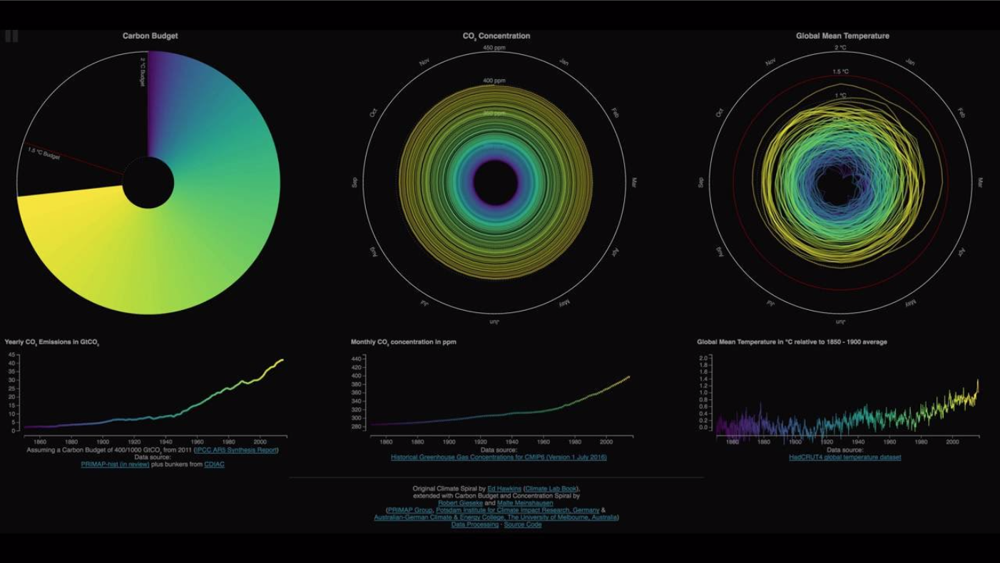

# Data Prompt 1a

## Explore and Visualize National Climate Data
### Background
As [this article](https://medium.com/on-blockchain-and-climate-accounting/the-blockchain-and-climate-intersection-a-primer-3a75f0150b5a) details, Earth’s atmosphere can hold a limited amount of carbon dioxide equivalent (CO2e) emissions before average global temperatures unleash the most costly and damaging impacts of climate change. The 2015 Paris Agreement set a goal to cap global temperature rise well below 2⁰C,  and aim for a limit of 1.5⁰C, relative to pre-industrial levels.

The global “carbon budget” represents the remaining allowable carbon dioxide emissions that can be released, consistent with the Paris Agreement’s goals of limiting global warming to under 1.5-2⁰C. Scientifically, the carbon budget is not a fixed number;  it has an uncertainty range and the data and knowledge used to calculate it is updated every year. However, [scientists estimate that approximately 600 GtCO2e remains in the budget](https://www.nature.com/articles/s41598-018-24241-1), while global annual emissions are around 40 GtCO2e. If current patterns of emissions continue, the world is expected to consume the remaining carbon budget in as little as 15 years.

As part of the Paris Agreement, countries have put forward Nationally Determined Contributions (NDCs), outlining their policies and strategies for helping to reach the Paris Agreement’s goal. Countries’ approaches to shaping their NDCs vary widely, in terms of their level of detail, policy and greenhouse gas emission reduction targets, and strategies for realizing these targets (e.g., through approaches focused on land use, carbon trading, renewable energy, etc.). 

While an important step forward, NDCs do not currently put the world on track to meet the Paris Agreement’s goal of limiting emissions below 1.5-2⁰C; instead, they set the world on a path towards [approximately 3°C](https://wedocs.unep.org/bitstream/handle/20.500.11822/26879/EGR2018_ESEN.pdf?sequence=10) of warming by 2100. Data analysis and visualization can help facilitate comparisons across different countries, assess the ambition of countries’ climate policies, and identify common themes or trends. Since countries are obligated to regularly update their NDCs, this kind of analysis can also empower policymakers, citizens, NGOs and other stakeholders identify potential strategies for strengthening these national climate plans.

### Challenge

**Explore data** on historic emissions, cumulative emissions, projected emissions, GDP, climate action pledges, and vulnerability to climate change. Understand the differences between countries’ carbon emissions and their efforts to address  global climate change (e.g., are high emitting countries also taking the most ambitious action?). 

**Create data visualizations** that help track progress towards climate goals, capture the urgency of climate action, or illustrate the need for improved burden sharing. 
- Consider experimenting with maps, interactive visualizations, or dashboards using tools such as Shiny, Plotly, Altair, Bokeh, Odyssey or any others of your choosing.

- Think of ways to go beyond line graphs to communicate the carbon budget.

- Think of ways to make abstract numbers more compelling to the general public (e.g., the impact of an addition degree or half of a degree of warming). 

- Consider incorporating some of these *key concepts*:
    - Fairness and equity
    - Gap between pledged mitigation and Paris goals
    - Importance of spatial and temporal trends (e.g., population or economic growth projections).
    - Urgency

### Inspiration

- Interactive storyboard: https://bri.kontinentalist.com

- Visualizing the limited time remaining to act on climate change: 

- Visualizing inequity in contribution and impact:
    - Also see http://paris-equity-check.org

- Layering multiple data sources together:

### Data Sources

Multiple datasets have been provided here: https://github.com/YaleOpenLab/hack4climate/tree/master/Prompt1a/data 

| Dataset Description | Source |
| ----------- | ----------- |
| Historical Greenhouse Gas Emissions by Country | World Resources Institute; United Nations Framework Convention on Climate Change |
| Pledged Adaptation/Mitigation Actions | World Bank |
| Quantification of Nationally Determined Contributions | United Nations Environment Programme; World Resources Institute |
| Climate Risk and Vulnerability | World Bank; Germanwatch; University of Notre Dame |
| Alignment of Nationally Determined Contributions and United Nations Sustainable Development Goals | World Resources Institute |
| U.S. Emissions Projections to 2050; International Emissions Projections to 2040 | U.S. Energy Information Administration |
| World Emissions Projections to 2050 | UK Department for Business, Energy and Industrial Strategy |
| National Emissions Projections to 2100 | Pacific Northwest National Laboratory |
|

All data was downloaded from: https://bit.ly/2F32tpj

### Prompt Owners and Mentors 
Data-Driven Lab: David Paolella, Amy Weinfurter, Angel Hsu