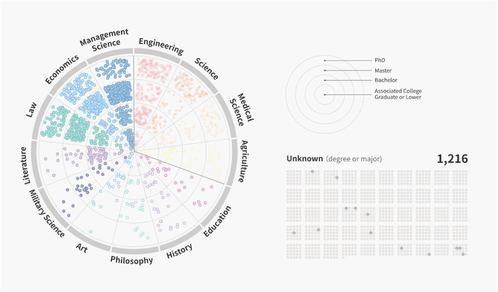
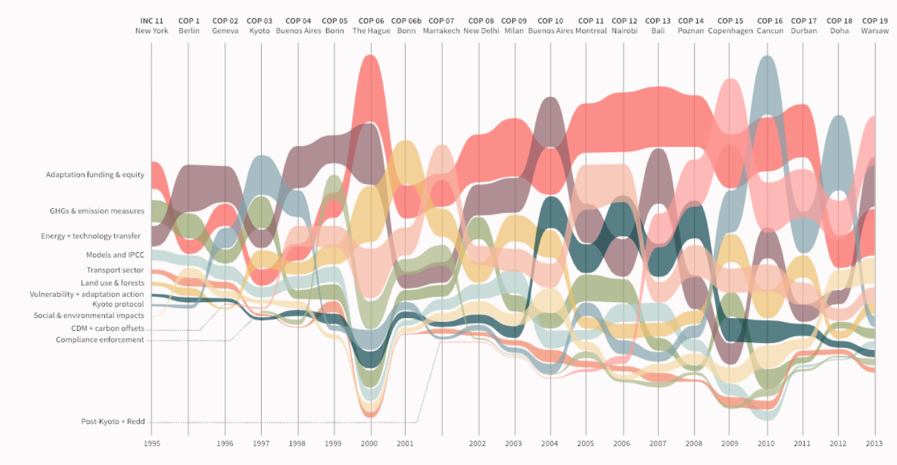

# Data Prompt 1b

## Understanding Cities’ Climate Action
### Background
Cities will play a pivotal role in determining the world’s response to climate change. Urban areas host just over half of the world’s population,[1](#fn1) generate roughly 80 percent of global GDP,[2](#fn2) and drive 70 percent of global energy-related carbon dioxide emissions.[3](#fn3) 3.9 billion people currently live in cities, a number expected to rise to 6.4 billion — two-thirds of the world’s population — by 2050.[4](#fn4) This leaves cities well-positioned to reduce greenhouse gas emissions and mitigate climate change. 

As the call to unlock climate change solutions grows increasingly urgent, cities – along with regions, businesses, investors, and civil society groups – have pledged their own efforts to mitigate and adapt to climate change, often going beyond national goals and policies. Already, more than 8,000 cities from 128 countries – representing 16 percent of the global population[5](#fn5) – have pledged to take action to address climate change. Their efforts range from targets for reducing a city’s greenhouse gas emissions, to commitments to install renewable energy, expand public transit, or create green spaces that provide shade and relief from urban heat. We have collected a dataset that includes these commitments, as well as contextual data about the cities pledging climate action. 

<a name="fn1">[1]</a> The World Bank. Urban population (% of total). Retrieved October 12 2018 from: https://data.worldbank.org/indicator/SP.URB.TOTL.IN.ZS.

<a name="fn2">[2]</a> The World Bank. Urban Development Overview. Washington, D.C.: The World Bank. Retrieved October 12 2018 from: http://www.worldbank.org/en/topic/urbandevelopment/overview.

<a name="fn3">[3]</a> International Energy Agency (IEA). (2016). Energy Technology Perspectives 2016: Towards Sustainable Urban Energy Systems. Paris, France: IEA. Retrieved from: https://www.iea.org/publications/freepublications/publication/EnergyTechnologyPerspectives2016_ExecutiveSummary_EnglishVersion.pdf.

<a name="fn4">[4]</a> United Nations (UN). (2014). World Urbanization Prospects. New York, NY: United Nations.

<a name="fn5">[5]</a> Data Driven Yale, NewClimate Institute, PBL 2018: Global climate action of regions, states and businesses. Research report published by Data Driven Yale, NewClimate Institute, PBL Netherlands Environmental Assessment Agency, prepared by project team of Angel Hsu, Amy Weinfurter, Andrew Feierman, Yihao Xie, Zhi Yi Yeo, Katharina Lütkehermöller, Takeshi Kuramochi, Swithin Lui, Niklas Höhne, Mark Roelfsema. Available at https://datadrivenlab.org/wp-content/uploads/2018/08/YALE-NCI-PBL_Global_climate_action.pdf

### Challenge

- Visualize the data:
    - Spatially/geographically - similar to [this map](https://datadrivenlab.org/climate/mapping-american-climate-action-whos-taking-charge-of-the-paris-agreement/) of city, company, and university climate action in the United States.
    - By sector - e.g., renewable energy, energy efficiency, buildings, emission reductions, forests, agriculture, private finance, carbon price, transport, etc. 

- Analyze any patterns or trends in the data: 
    - Conduct a text analysis using [Rapidminer](https://rapidminer.com/), [TextStat](http://neon.niederlandistik.fu-berlin.de/en/textstat/), [Wmatrix](http://ucrel.lancs.ac.uk/wmatrix/), or [a different tool of your choice](https://guides.library.duke.edu/c.php?g=289707&p=1930856), and visualize common themes and words mentioned in climate actions.
    - By key contextual information - e.g., city population, land area, or emissions. 
    - Ways to identify ‘peer cities’ - what cities seem similar to each other?
    - Based on the current database of subnational commitments, can we predict what other cities are likely to take action/pledge commitments? 

### Inspiration

Visualizing data across different sectors or categories:

Changing frequency of climate negotiation topics over time:

### Data Requirement and Sources

- Contextual data: contains information about city’s population, area, lat/long coordinates, state/region/province, etc.
- Commitment data: information about a commitment’s emissions, target, target year, etc. 
- Metadata: https://docs.google.com/spreadsheets/d/1QgnYnGR3vPRfCG2OsaWAxEDl3-ZR5dcyrzPZQ5oOl8M/edit#gid=0 

***Note**: Please see the prompt owners to get access to the contextual and commitment data. Since this data cannot be used or shared beyond this event, we ask that you agree to a non-disclosure agreement. Email Amy Weinfurter at amy.weinfurter@yale.edu with questions.* 

### Prompt Owners and Mentors 
Data-Driven Lab: Amy Weinfurter, Angel Hsu, David Paolella